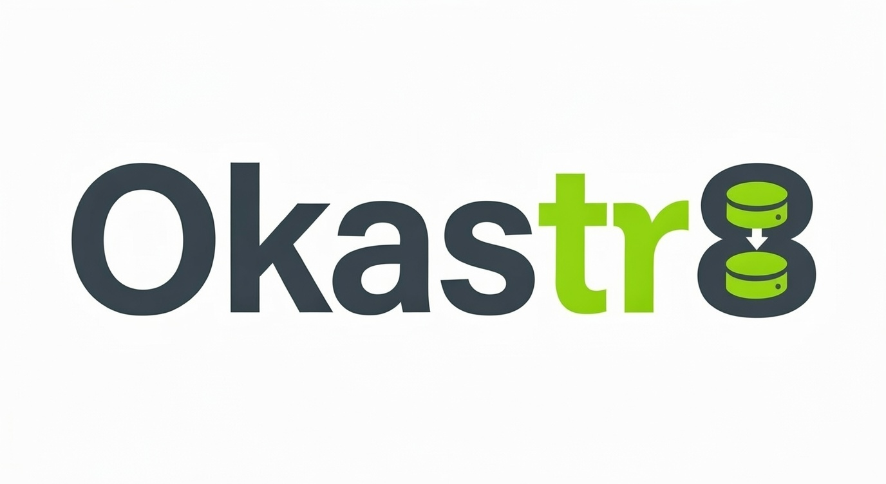

# Okastr8



**The Open-Source PaaS for Your Own Servers**

Okastr8 (pronounced "orchestrate") is a self-hosted Platform-as-a-Service that brings the simplicity of Vercel or Railway to your own Linux servers. It provides a beautiful dashboard and a powerful CLI to manage deployments, monitor resources, and handle system configurations without the vendor lock-in.


---

## 🚀 Features

- **🖥️ Beautiful Dashboard**: Modern, responsive UI to manage apps and users.
- **⚡ Powerful CLI**: Automate everything from deployments to server hardening.
- **🔄 Git-based Deploys**: Connect GitHub repositories, setup webhooks, and auto-deploy on push.
- **🐳 Docker Support**: Native support for Dockerfile-based deployments.
- **🔒 Zero-Trust Security**: Token-based authentication, role-based access, and SSH hardening.
- **📊 Real-time Metrics**: Monitor CPU, RAM, and Disk usage per app and system-wide.
- **🤖 Systemd Integration**: Manages applications as robust systemd services.

---

## 📦 Installation (For Users)

### Requirements
- A fresh or existing Linux server (Debian/Ubuntu recommended).
- Root or sudo access.

### Quick Install
Run the following command to install Okastr8. This script will install the Bun runtime, set up the necessary services, and configure your environment.

```bash
curl -fsSL https://raw.githubusercontent.com/Makumiii/okastr8/main/scripts/bash/install.sh | bash
```

**What this does:**
1.  Installs **Bun** (if not already present).
2.  Clones the repository to `~/okastr8`.
3.  Installs dependencies.
4.  Creates the `okastr8-manager` systemd service (runs the dashboard/API).
5.  Sets up the `okastr8` global CLI command.

### Post-Install Setup
After installation, you can verify everything is running:

```bash
# Check CLI version
okastr8 --version

# Check manager server status
systemctl status okastr8-manager
```

Access your dashboard at: `http://<your-server-ip>:41788`

---

## 🔗 GitHub Integration Setup

To enable GitHub-based deployments, you need to create a GitHub OAuth App and configure Okastr8.

### Step 1: Create a GitHub OAuth App

1. Go to **GitHub → Settings → Developer Settings → OAuth Apps → New OAuth App**
2. Fill in the form:
   - **Application name**: `Okastr8` (or any name you prefer)
   - **Homepage URL**: `http://your-server-ip:41788`
   - **Authorization callback URL**: `http://your-server-ip:41788/api/github/callback`
3. Click **Register application**
4. Copy the **Client ID**
5. Click **Generate a new client secret** and copy it

> **Using a tunnel?** If you're using Cloudflare Tunnel (e.g., `https://okastr8.yourdomain.com`), use that URL instead of the IP address.

### Step 2: Add Credentials to Okastr8

Create or edit `~/.okastr8/system.yaml`:

```bash
mkdir -p ~/.okastr8
nano ~/.okastr8/system.yaml
```

Add your credentials:

```yaml
manager:
  github:
    client_id: "Ov23liXXXXXXXXXXXXXX"
    client_secret: "your_client_secret_here"
```

### Step 3: Connect Your Account

```bash
okastr8 github connect
```

This will open a browser for GitHub authorization. Once complete, your access token is automatically saved.

---

## 🛠️ Usage

### 1. Authenticate
To access the dashboard, you need a login token. Generate one via the CLI:

```bash
okastr8 auth token
# Output: Copy the token and paste it into the dashboard login screen.
```

### 2. Connect GitHub
Enable seamless deployments by connecting your GitHub account:

```bash
okastr8 github connect
```
Follow the OAuth flow to grant access to your repositories.

### 3. Deploy an App
You can deploy apps directly from your GitHub repositories via the Dashboard or CLI.

**Via CLI:**
```bash
# Interactive repo selection
okastr8 github repos

# Or trigger a deployment if already configured
okastr8 deploy trigger my-awesome-app
```

**Via Dashboard:**
1.  Go to **Apps**.
2.  Click **Import from GitHub**.
3.  Select your repository and configure the port/domain.
4.  Click **Deploy**.

---

## 👨‍💻 Developer & Contribution Guide

We welcome contributions! Okastr8 is built with **TypeScript**, **Bun**, **Hono**, and **SvelteKit**.

**Note for Contributors**: Do not run the `install.sh` script on your development machine if you intend to modify the code. That script is for end-users and installs to a specific system path. Instead, follow the manual setup steps below.

### 1. Prerequisite
- [Bun Runtime](https://bun.sh) (latest)
- Git

### 2. Clone & Install Dependencies
```bash
# Clone the repository
git clone https://github.com/Makumiii/okastr8.git
cd okastr8

# Install backend/CLI dependencies
bun install

# Install dashboard (frontend) dependencies
cd dashboard
npm install
cd ..
```

### 3. Setup Config & Permissions
Okastr8 relies on running certain system commands (like systemd, docker, or caddy) without password prompts. We include a helper to configure this for you safely (it creates a file in `/etc/sudoers.d/`).

```bash
# Run the sudoers setup (required for fully functional CLI testing)
sudo bun run src/main.ts setup sudoers
```
*You only need to run this once.*

### 4. Build the Dashboard
The manager server serves the static UI files from the `public/` directory. You must build the dashboard first:

```bash
cd dashboard
npm run build
cd ..
# Check that 'public/' folder now exists
ls -d public
```

### 5. Running Locally
You can now run the services directly from your source code.

**Start the Manager Server (API + UI):**
```bash
bun run src/managerServer.ts
```
The server will start at `http://localhost:41788`.

**Run CLI Commands:**
Use `bun run src/main.ts` to execute CLI commands against your local code:

```bash
bun run src/main.ts --help
bun run src/main.ts app list
bun run src/main.ts deploy trigger my-test-app
```

### 6. Development Workflow
- **Frontend Changes**: Edit files in `dashboard/src`. Run `npm run build` in `dashboard/` to update the static output, or run `npm run dev` in `dashboard/` for a separate HMR dev server (note: api calls might need proxy configuration if running separately).
- **Backend/CLI Changes**: Edit files in `src/`. Bun runs TypeScript natively, so no build step is needed for testing backend logic.

---

## 📂 Project Structure

- `src/` - Backend API and CLI logic (Hono, Commander).
    - `commands/` - CLI command implementations.
    - `managerServer.ts` - Main entry point for the API server.
    - `main.ts` - Entry point for the CLI.
- `dashboard/` - SvelteKit frontend application.
- `scripts/` - Installation and system setup scripts.
- `public/` - Compiled frontend assets (gitignored).

---

## 📄 License

MIT License. See [LICENSE](LICENSE) for details.

---

**Built with ❤️ for the Open Source Community**
